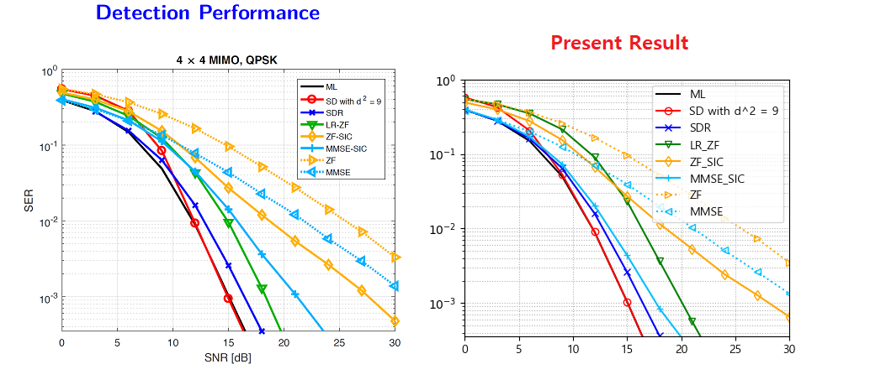

# [Modification on 5G NR mapper.](https://www.researchgate.net/figure/Modification-on-5G-NR-mapper_fig2_342162911)


# 만들고자하는 그래프



코드 수정 목록
```python
# 시작 _ 12.05
```

## Dependencies
python 3.10

### Packages
```
numpy
opencv
```

### How to install
1. env
```sh
conda create -n communicationsystem python=3.10
```
2. activate
```sh
activate communicationsystem
cd PycharmProjects\For_Assignment_2022
```

3. install requirements
```sh
conda install --file requirements_conda.txt
``` 

## How to run

```sh
python main_simul.py
``` 
